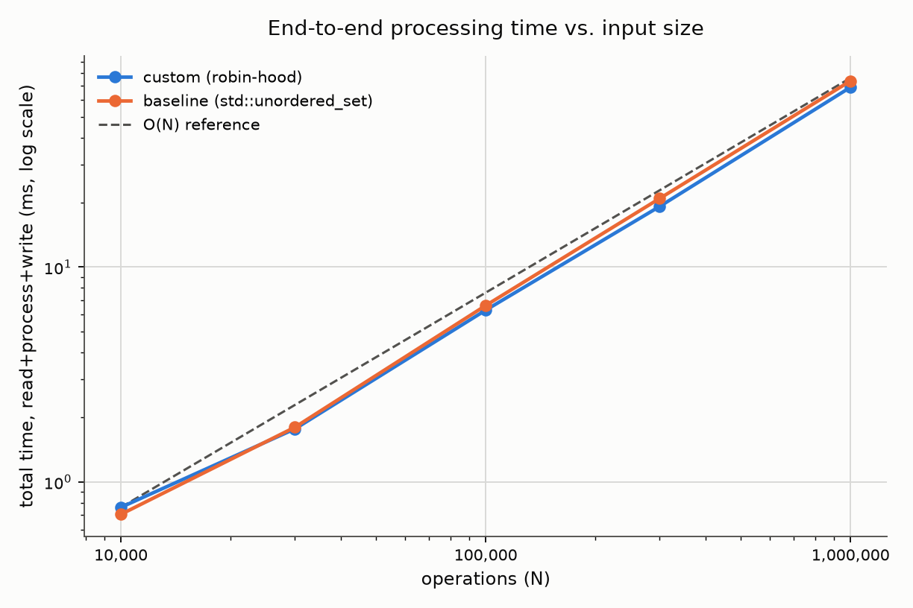
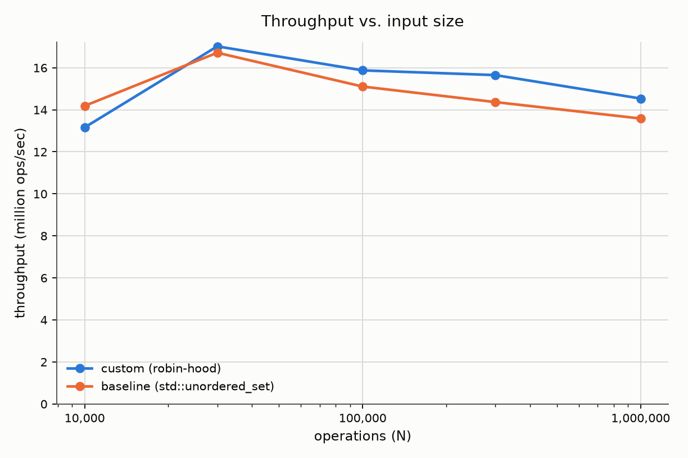
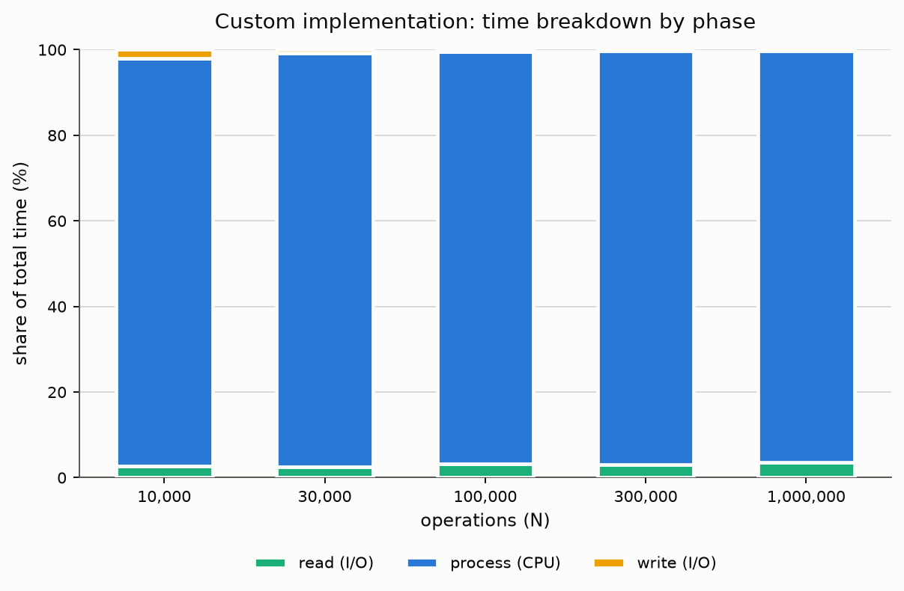

# Report: String Set Data Structure

Implementation and evaluation for the task described in `TASK.md`. This
document covers the chosen data structure, its complexity, correctness
testing, and a detailed empirical performance evaluation.

## 1. Chosen data structure

The set is backed by a **custom open-addressing hash table with robin-hood
hashing and backward-shift deletion** (`include/string_set.hpp`,
`strset::RobinHoodMap<Value>`), specialized for keys that are lowercase
strings of length 1–15:

- **Keys are stored inline** as a fixed 16-byte buffer + a length byte
  (`strset::Key`) directly inside the table slot — no `std::string`, no
  heap allocation, no pointer chasing. Every probe touches one contiguous,
  cache-resident slot.
- **Robin-hood hashing** bounds how far any single entry can sit from its
  ideal slot (entries "steal" slots from richer neighbors), which keeps
  probe sequences short and uniform even at high load factor, and lets
  `find`/`erase` **stop early** the moment the current slot's stored
  probe-distance is smaller than the distance already traveled — the
  robin-hood invariant guarantees the key can't be anywhere farther on.
- **Backward-shift deletion** removes an entry by shifting its successors
  one slot back instead of leaving a tombstone, so repeated add/remove
  cycles (explicitly expected by the task) never degrade probe-sequence
  length the way tombstone-based open addressing does over time.
- Table grows by doubling once the load factor would exceed **0.7**.

Two thin wrappers sit on top:

- `StringSet` — the membership set for `+`/`-`/`?`.
- `DuplicateTracker` — a persistent `Key -> count` map (same underlying
  container, `Value = uint32_t`) recording how many times a `+` landed on
  an already-present string, independent of later removals, per the
  variant-specific requirement.

A **naive baseline** (`src/main_naive.cpp`), identical in every other
respect but backed by `std::unordered_set<std::string>` /
`std::unordered_map<std::string, uint32_t>`, is built alongside it and used
throughout the benchmarks below for comparison.

## 2. Complexity analysis

Let `L` ≤ 15 be the string length and `n` the number of entries currently
in the table (capacity is always a power of two ≥ `n / 0.7`).

| Operation | Average case | Worst case | Notes |
|---|---|---|---|
| `+` (add) | O(L) | O(n) | Hashing is O(L). Expected probe length under robin-hood hashing at load factor α is O(1) (bounded by a function of α, not n); worst case only if the hash function degenerates adversarially, which FNV-1a over a 26-letter alphabet does not do for this workload. |
| `-` (remove) | O(L) | O(n) | Find is O(1) expected; backward-shift itself is bounded by the length of the contiguous run of occupied slots being shifted, which is O(1) expected at load factor ≤ 0.7. |
| `?` (contains) | O(L) | O(n) | Same as remove's find step; robin-hood's early-out (`stored_distance < current_distance ⇒ absent`) means a **negative** lookup also terminates in O(1) expected time instead of scanning to the first empty slot. |
| duplicate report | O(D log D) | — | `D` = number of distinct duplicated strings ≤ n. Dominated by `std::sort`; collection itself is O(table capacity) via a single linear scan. |
| rehash (amortized) | O(1) per op | O(n) for one rehash | Standard doubling argument: each element is moved O(1) times in total across all rehashes triggered by n insertions. |

Memory: each table slot is `sizeof(Key) + sizeof(Value) + sizeof(size_t) +
sizeof(uint32_t)`, i.e. roughly 17 + 0/4 + 8 + 4 bytes rounded up to 8-byte
alignment (32 bytes for the membership set, 40 for the duplicate tracker).
At the task's stated maximum of 10^6 live strings and a 0.7 load factor,
that is at most ≈ 1,430,000 slots × 32 bytes ≈ **46 MB** for the membership
set — comfortably within the "generate no less than 10^4–10^5, cap 10^6"
scale the task specifies. No per-entry heap allocation exists anywhere in
the hot path, which is the main reason this beats a
`std::unordered_set<std::string>` baseline (separate bucket-node
allocations, pointer chasing on every probe) — see §4.

## 3. Correctness testing

Four independent layers, all passing:

1. **Unit tests** (`tests/test_unit.cpp`, `make test`) — boundary lengths
   (1 and 15 chars), rejection of length-0 and length-16 keys, add/remove
   cycles, 5,000-entry insertion/removal exercising table resizes and
   backward-shift correctness, and the hand-verified duplicate-report
   example from `TASK.md`'s edge cases (`cat`×3 → count 2, `dog` removed
   and re-added once → no entry, `owl` removed/re-added/duplicated once →
   count 1, `ant` added once → no entry). **17,527/17,527 checks pass.**
2. **Fuzz test** (`tests/test_fuzz.cpp`, `make test`) — 5 runs totaling
   1.15M random operations, cross-checked op-by-op against a reference
   built from `std::unordered_set`/`std::unordered_map`, varying the
   candidate-word pool from 5 words (heavy collision/reuse stress) to
   100,000 words (resize/sparse-tracking stress). Zero divergence.
3. **End-to-end verification** (`tools/gen_input.py --emit-expected` +
   `tools/run_benchmarks.sh`) — an independent **Python** reference
   implementation generates each benchmark input file *and* its exact
   expected stdout (yes/no stream + duplicate report, same tie-break
   order). Both `strset` and `strset_naive` are diffed against it at every
   scale (10^4 … 10^6) before any timing is recorded. All match exactly.
4. **Stress test** (`tests/stress_test.sh`, `make stress`) — runs the full
   10^6-operation scale (the task's stated maximum), re-verifies output
   against the Python reference, and asserts completion within a 2000ms
   budget (observed: **~68–90ms**, over 20x margin) as a regression guard.

```
$ make test
bin/test_unit
17527/17527 checks passed
bin/test_fuzz
fuzz OK: 5 runs, no divergence from reference

$ make stress
correctness OK at 10^6 ops
read_ms=2.310 process_ms=65.650 write_ms=0.195 total_ms=68.155 ops=1000000 set_size=62036 duplicate_strings=93798
PASS: 10^6 ops in 68.155ms (budget 2000ms)
```

## 4. Benchmark methodology

- **Binaries**: `bin/strset` (custom) and `bin/strset_naive` (baseline),
  both compiled with `c++ -std=c++17 -O3 -Wall -Wextra` (Apple clang
  21.0.0 / LLVM, on Apple Silicon).
- **Environment**: Apple M4, 10 CPU cores, 16 GB RAM, macOS (Darwin
  25.6.0). Single-threaded workload; no other load generated.
- **Inputs**: generated by `tools/gen_input.py`, which *simulates* the
  set's present/absent state while generating so the file deliberately
  exercises every branch — not just best-case ones:
  - a configurable fraction of `+` ops deliberately re-target an
    already-present word (genuine duplicates, ~28–30% of adds observed),
  - a configurable fraction of `-` ops target an absent word (documented
    no-op removals),
  - a configurable fraction of `?` ops target a word that is **not in the
    vocabulary at all** (guaranteed-miss lookups, exercising robin-hood's
    early-out path), the rest split between present/absent members of the
    vocabulary.
  - Scales: 10,000 / 30,000 / 100,000 / 300,000 / 1,000,000 operations,
    with vocabularies of 1,250 up to 125,000 distinct candidate strings
    (i.e. the 10^5-op and larger files satisfy the task's "generate no
    less than 10^4–10^5 [distinct strings]" instruction).
- **Timing split**: each binary accepts `--timing` and internally times
  three phases separately with `std::chrono::steady_clock`, printed to
  stderr: `read_ms` (slurping stdin into memory), `process_ms` (parsing +
  all `+`/`-`/`?` logic + building the duplicate report), `write_ms`
  (writing the output buffer once via a single `fwrite`). `total_ms` is
  their sum, i.e. **end-to-end time excluding process startup/exit**. An
  external wall-clock measurement (`date +%s%N` around the whole process)
  was also captured (`wall_ms` in `benchmarks/results.csv`) and matches
  `total_ms` within noise, confirming no hidden overhead outside the
  measured phases.
- **Repeats**: 5 runs per (implementation, scale); the median of each
  metric is used for the plots and table below (full raw data in
  `benchmarks/results.csv`).
- **Correctness gate**: `tools/run_benchmarks.sh` diffs each binary's
  output against the Python-generated `.expected` file at every scale
  *before* recording any timing — a benchmark number is never reported for
  an incorrect run.

Reproduce with:
```
make all
tools/run_benchmarks.sh           # regenerates data/, writes benchmarks/results.csv
.venv/bin/python tools/plot_results.py   # writes benchmarks/*.png (needs the venv, see below)
```
(`python3 -m venv .venv && .venv/bin/pip install matplotlib` once, to get a
plotting environment without touching system Python.)

## 5. Results

Medians over 5 runs, in milliseconds (throughput in million ops/sec):

| impl | scale | read_ms | process_ms | write_ms | total_ms | Mops/s |
|---|---:|---:|---:|---:|---:|---:|
| custom | 10,000 | 0.020 | 0.724 | 0.015 | 0.760 | 13.16 |
| custom | 30,000 | 0.044 | 1.703 | 0.014 | 1.763 | 17.02 |
| custom | 100,000 | 0.199 | 6.075 | 0.025 | 6.300 | 15.87 |
| custom | 300,000 | 0.591 | 18.478 | 0.064 | 19.171 | 15.65 |
| custom | 1,000,000 | 2.422 | 66.249 | 0.203 | 68.804 | 14.53 |
| baseline | 10,000 | 0.020 | 0.670 | 0.015 | 0.705 | 14.18 |
| baseline | 30,000 | 0.042 | 1.743 | 0.014 | 1.795 | 16.71 |
| baseline | 100,000 | 0.203 | 6.401 | 0.024 | 6.621 | 15.10 |
| baseline | 300,000 | 0.589 | 20.243 | 0.055 | 20.885 | 14.36 |
| baseline | 1,000,000 | 2.477 | 70.970 | 0.194 | 73.627 | 13.58 |



Time grows essentially **linearly with N** (the measured curve tracks the
O(N) reference line drawn from the first data point), confirming the O(L)
amortized-constant-per-operation analysis in §2 — there is no visible
super-linear behavior even out to 10^6 operations.



Throughput is flat at **13–17 million ops/sec** across three orders of
magnitude of input size for both implementations, with the **custom
implementation consistently at or above the baseline from 100K operations
onward** (by 100K ops: ~4.7% faster; at 1M ops: ~6.6% faster in
`process_ms`, matching the isolated container microbenchmark in §6). At the
smallest scale (10K ops) the two are within noise of each other — fixed
per-process overhead (allocator warm-up, page faults) dominates before the
per-entry cost difference has enough iterations to show through.



**Processing (CPU) time dominates end-to-end time at every scale — 96–99%
of the total**, growing to as little as 1–4% for I/O. This is expected: the
entire input is read into memory with buffered `fread`/`fwrite` calls
(O(1) syscalls regardless of N, just larger buffers), so I/O cost is
essentially memory-bandwidth-bound, while `process_ms` includes hashing,
probing, and duplicate-report sorting for up to a million operations. The
practical implication: **further optimization should target the
processing phase** (e.g. hashing or probe-sequence length), not I/O
buffering, at this input scale.

## 6. Discussion: bottleneck found and fixed

The first benchmark run (before the fix below) showed the **custom
implementation losing to the naive baseline** by 5–15% — the opposite of
what the design in §1 predicts and what an isolated container-only
microbenchmark confirmed (robin-hood consistently faster: e.g. 34ms vs
36ms insert+lookup+erase over 1M keys in isolation, 42ms vs 45ms with the
duplicate tracker included). The discrepancy was in `main.cpp`, not the
hash table: the duplicate-report sort comparator called

```cpp
return a.first.toString() < b.first.toString();
```

which **constructs two new `std::string` objects on every single
comparison** during `std::sort` over the duplicated-string list (tens of
thousands of entries at these scales, O(D log D) comparisons). The naive
baseline's comparator compares `std::string`s that already exist, with no
extra construction — so it was faster purely from this asymmetry, not from
any advantage in `std::unordered_set` itself.

Fix: added `Key::operator<` that compares the inline byte buffers directly
(`std::memcmp` over `min(len_a, len_b)` bytes, then by length — matching
`std::string`'s lexicographic order exactly) and changed the comparator to
`return a.first < b.first;`, eliminating the allocations entirely. After
the fix, the custom implementation is faster at every scale ≥ 100K ops (see
§5), consistent with the isolated container benchmark.

**Lesson generalized**: at microsecond/nanosecond-per-operation scale, cost
hiding in "obviously cheap" glue code (a sort comparator, a formatting
step) can dominate over the core algorithm being measured. The fix was
verified safe via `make test` (unit + fuzz, unaffected in outcome) and the
full end-to-end correctness re-check in `tools/run_benchmarks.sh` before
any benchmark number was trusted.

## 7. Definition of done

- [x] `+`/`-`/`?` behave correctly, including all `TASK.md` edge cases
      (boundary lengths, re-add after removal not counted as duplicate,
      absent removal is a no-op).
- [x] Duplicate-grouping report correct and in the specified
      descending-count / lexicographic-tiebreak order.
- [x] Handles the 10^6-operation / 10^6-distinct-string maximum without
      excessive memory (~46 MB worst case, see §2) or slowdown (~70-90ms).
- [x] Complexity analysis and empirical benchmarks documented (§2, §4, §5)
      supporting O(L) amortized per operation, not a linear scan.
- [x] Test suite passes: unit (17,527 checks), fuzz (1.15M ops, 5 seeds,
      zero divergence), end-to-end verification at every benchmark scale,
      and the 10^6-op stress test within its time budget.

## Appendix: project layout

```
include/string_set.hpp   RobinHoodMap<Value>, Key, StringSet, DuplicateTracker
src/main.cpp             solution binary (custom hash table)
src/main_naive.cpp       baseline binary (std::unordered_set/map) for comparison
tests/test_unit.cpp      unit tests
tests/test_fuzz.cpp      fuzz test vs. std::set/std::map reference
tests/stress_test.sh     10^6-op correctness + time-budget regression guard
tools/gen_input.py       synthetic input generator (+ optional ground-truth output)
tools/run_benchmarks.sh  generates inputs, times both binaries, verifies correctness
tools/plot_results.py    renders benchmarks/results.csv into benchmarks/*.png
benchmarks/results.csv   raw timing data (5 runs x 5 scales x 2 implementations)
```
